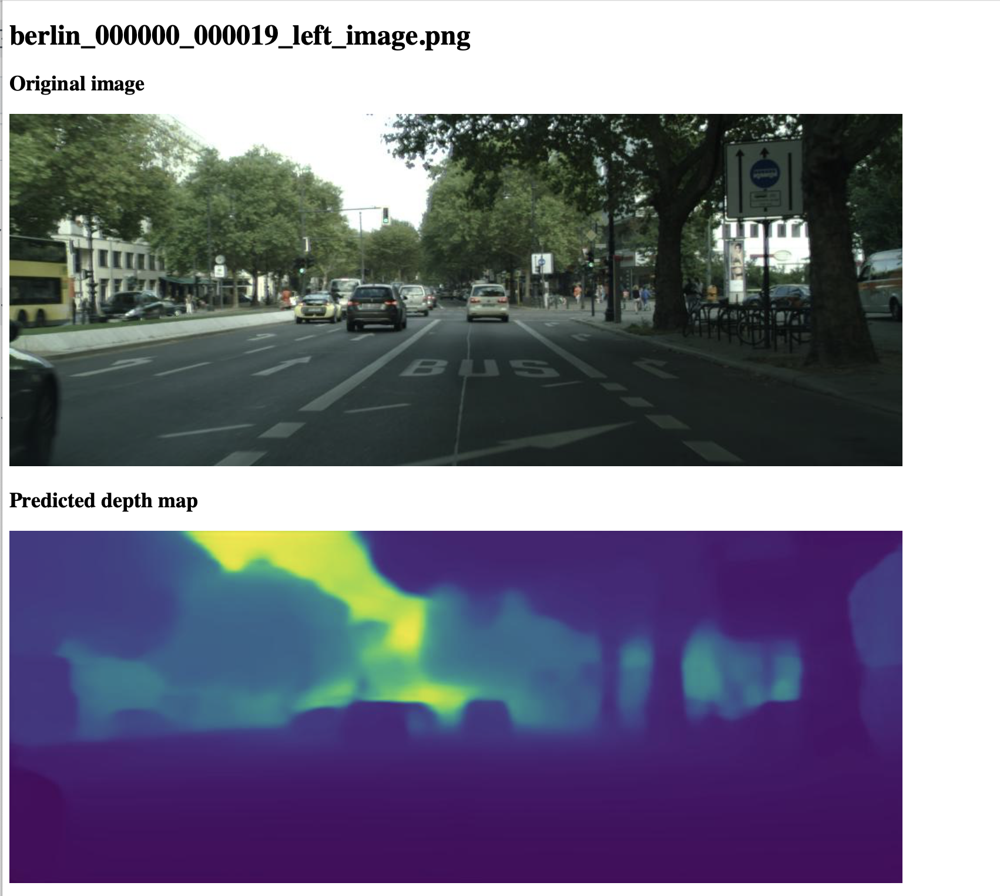

# API Implementation

An API is implemented to serve the model. The app is made in Flask and the code can be found in *src/run.py*.

The route **/upload** directs to a page to upload a file. Once the user uploads a file, the function checks if it receives a file and if the file is an image format. If this is the case, the request gets redirected to /direct_upload.

The route **/direct_upload** expects an image sent through a POST request. This image is saved in the upload folder. Next, the request gets redirected to /predict.

The class MiDaSFineTuner is defined in the *model_loader.py* file. The model was previously trained on a local machine and the weights are stored in *models/DPT_Hybrid_1.ckpt*. The weights get loaded from this location in *src/run.py*.
The function *make_prediction(img)* prepares the image, runs inference and transforms the output depth map to a visual image.
The route **/predict** calls the function *make_prediction(img)*. The resulting depth image is saved to the output folder and redirects to /result/<img_name>.

The **/result/<img_name>** reads the original image from the upload folder and the predicted depth map from the output folder. Next, the images get encoded and displayed through the html template in *templates/result.html*.

Finally, a Dockerfile was created to run the flask app locally in a container.
