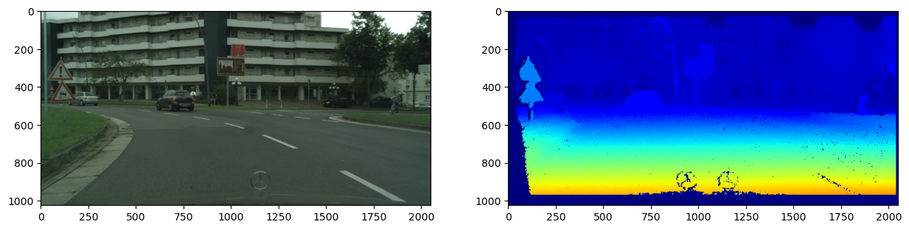
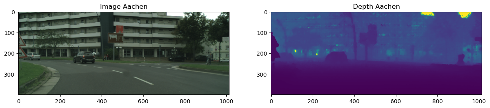

# Exploratory Data Analysis (EDA)
This section explains the exploratory data analysis (EDA)

## Cityscapes Dataset
The dataset to train, validate and test the model is the Cityscapes dataset (https://www.cityscapes-dataset.com).
The dataset contains images of urban street scenes captured in German cities. Images were captured using a stereo camera. Both the left and right RGB image (8bit) are made publically available. Also, the disparity is shared, which can be used to create depth maps.

### Overview
Total number of images: 5000 \
Training set:  2975 \
Validation set:  500 \
Test set:  1525

Image Size: (2048, 1024)

#### Training Set
| City            |   Number of images |
|-----------------|--------------------|
| aachen          |                174 |
| bochum          |                 96 |
| bremen          |                316 |
| cologne         |                154 |
| darmstadt       |                 85 |
| dusseldorf      |                221 |
| erfurt          |                109 |
| hamburg         |                248 |
| hanover         |                196 |
| jena            |                119 |
| krefeld         |                 99 |
| monchengladbach |                 94 |
| strasbourg      |                365 |
| stuttgart       |                196 |
| tubingen        |                144 |
| ulm             |                 95 |
| weimar          |                142 |
| zurich          |                122 |

#### Validation Set
| City      |   Number of images |
|-----------|--------------------|
| frankfurt |                267 |
| lindau    |                 59 |
| munster   |                174 |

#### Test Set
| City       |   Number of images |
|------------|--------------------|
| berlin     |                544 |
| bielefeld  |                181 |
| bonn       |                 46 |
| leverkusen |                 58 |
| mainz      |                298 |
| munich     |                398 |

\
Number of images per city: \

### Sample Images
Sample image Aachen: \

Sample image Hanover: \

### Disparity
The Cityscapes dataset also contains the disparity for each image pair. This disparity will be used to calculate the depth.

The disparity for the Aachen sample image:

There are a few things that stand out on the disparity map:
* There is some missing information on the left side.
* There is missing information in the bottom, caused by the hood of the car.
* The Mercedes emblem is shown two times, because of the stereo camera
* There is some noise

These issues will be handled in the data preparation.

## Resized dataset (After Data Preparation)

Images have now a height of 400 pixels. \
Depth maps have been created.

