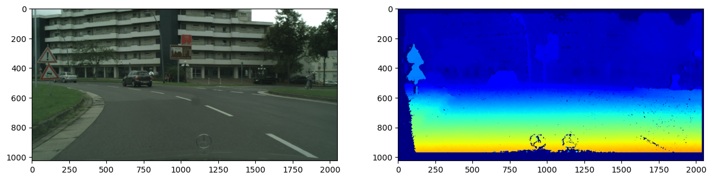
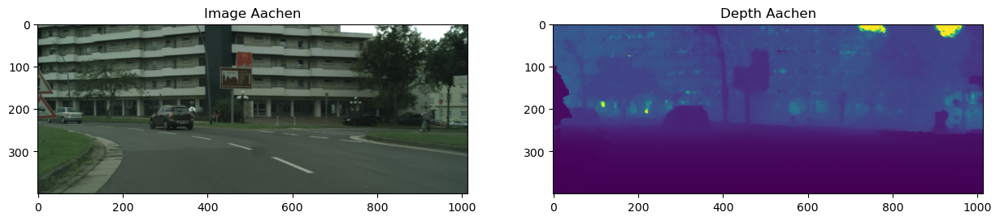

# Data Preparation
During the data preparation step, two main tasks will be done for each image in the Cityscapes dataset. First, the depth map is calculated from the disparity. Second, the images are resized to reduce the necessary storage space.

## Depth map
The Cityscapes dataset includes the disparity for each image pair. This disparity is used to calculate the depth map for each image.

First, the disparity image is cropped to discard the missing information in the left and bottom.
Next, the spots with missing values (infinite depth) are filled by using performing inpainting on the disparity map. Then, the disparity map is blurred to decrease the noise.
Finally, the depth is calculated and the depth image is clipped with a max depth of 500.

Calculation of the depth is based on following [notebook](https://github.com/itberrios/CV_projects/blob/main/multitask_depth_seg/data_exploration/cityscapes_dataset_depth_intuition.ipynb).

## Resizing

The images are cropped as the disparity map to discard the missing info and the hood of the car. Then the images and depth maps are resized to a height of 400 pixels. This is done to reduce the storage space needed for the dataset and to speed up model training.

Sample image after resizing and depth image: \

